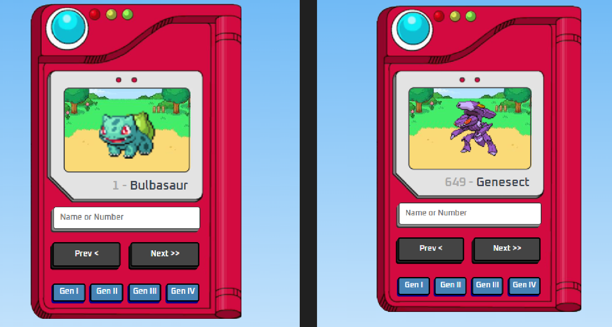
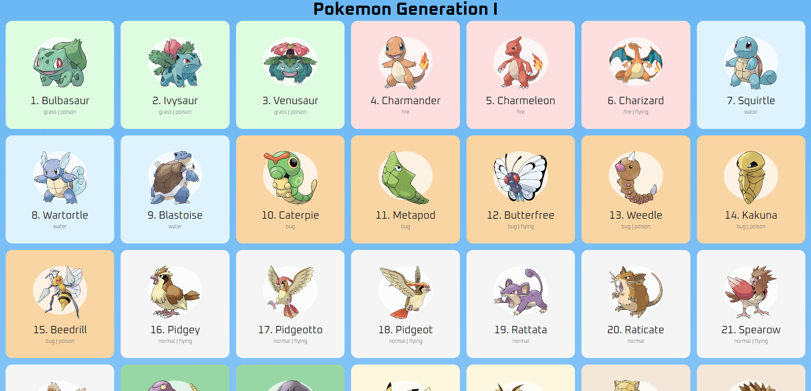
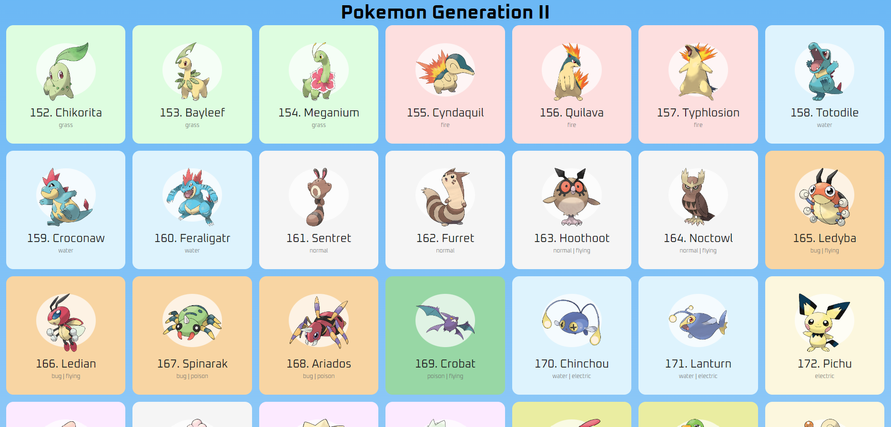
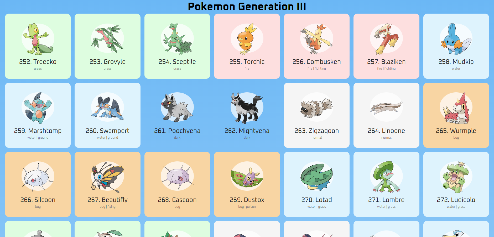
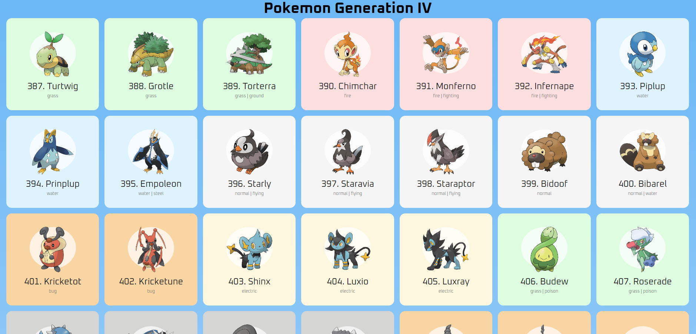

## Pokédex

### 📄 Descrição:

Projeto responsivo feito com JavaScript assíncrono, HTML, CSS e a PokéAPI pública.

##

### 💻 Layout:

- nesta montagem da primeira tela, mostro que, clicando nos botões 'Prev <' e/ou 'Next >>', é possível ter acesso desde o Pokémon 1 até o Pokémon 649:
<h1>
  
</h1>
 

- tela que mostra os Pokémons da primeira geração, clicando no botão 'Gen I':
<h1>
  
</h1>
 

- tela que mostra os Pokémons da segunda geração, clicando no botão 'Gen II':
<h1>
  
</h1>

- tela que mostra os Pokémons da terceira geração, clicando no botão 'Gen III':
<h1>
  
</h1>
 

- tela que mostra os Pokémons da quarta geração, clicando no botão 'Gen IV':
<h1>
  
</h1>

### 📍 Autora:

- NATHÁLIA MIRIAM
- LinkedIn: https://www.linkedin.com/in/nathaliamiriam/
- Portfólio: https://nathaliamiriam.github.io/
